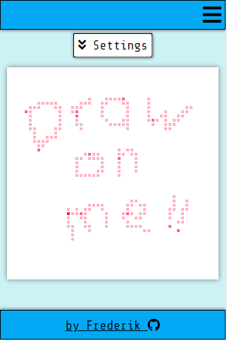

# Etch-A-Sketch

## Introduction
A drawing board inspired by the popular childrens toy Etch-A-Sketch.  

Drawings are generated in a pixel-style by adding multiple color-layers over individual elements. Background color as well as the current color can be freely selected with options for the shape of the pixels, the size of the drawing board and how quickly new color layers are added.

The app allows the user to create accounts and to save drawings to a database with customization options for a drawing like size, and color themes.  

Drawings of other users can be viewed, customized and saved to own accounts.

***

## Final Project
https://etchthesketch.herokuapp.com

***

## Behind the scenes
### Frontend
* React
* Sass

### Backend
* Laravel
* PostgreSQL

### Hosting
* Heroku
* ElephantSQL

***

## Preview Images
### Main View

### Mobile View

### Gallery

### Settings

